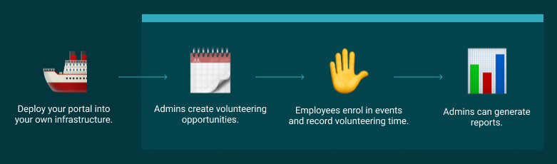
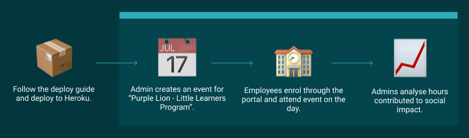

⚠️ This project is no longer actively maintained. Issues and Pull Requests will not be monitored.

# Volunteer Portal

Volunteer Portal is a platform designed to present, track, and report volunteering opportunities. Whether you're a large company, small business, nonprofit, or just a group of amazing people, Volunteer Portal can help you be more active in your community.

**Demo:** [https://volunteer-portal-demo.herokuapp.com/](https://volunteer-portal-demo.herokuapp.com/)

## How it works

## Example

## About
### Contributing
We're a small team at [Zendesk](http://zendesk.com/) that volunteer to maintain and launch features. If you'd like to be a regular contributor, please reach out to us on our [slack channel](https://join.slack.com/t/zendesk-volunteer/shared_invite/enQtNDczNTM5MzEwNjQwLTNmMmI3NzdlNjg4ODc4ZDFmYzBkODljZWQ2NmY0OWM3NDliOTdlMzAzOTdkZTBiYjBmMmQ3ZGFjOTFlMjdlNDk) and we'll be happy to onboard you. Otherwise, we're open to changes - open a pull request for us to review.

### Impact
We use the volunteer portal at [Zendesk](http://zendesk.com/) to record our volunteering hours. We've also had numerous organizations run the portal on their [own infrastructure](./docs/deploy.md).

## Roadmap
You can view future features on our [projects board](https://github.com/zendesk/volunteer_portal/projects).

## Resources
**Help on Slack:** [Join the Zendesk Volunteer Slack Workspace](https://join.slack.com/t/zendesk-volunteer/shared_invite/enQtNDczNTM5MzEwNjQwLTNmMmI3NzdlNjg4ODc4ZDFmYzBkODljZWQ2NmY0OWM3NDliOTdlMzAzOTdkZTBiYjBmMmQ3ZGFjOTFlMjdlNDk)

* [Deploying your own Volunteer Portal](docs/deploy.md)
* [Development](docs/development.md)
* [Copyright and license](#copy-right-and-license)

## Copyright and license

Copyright 2018 Zendesk, Inc.

Licensed under the Apache License, Version 2.0 (the "License");
you may not use this file except in compliance with the License.
You may obtain a copy of the License at

    http://www.apache.org/licenses/LICENSE-2.0

Unless required by applicable law or agreed to in writing, software
distributed under the License is distributed on an "AS IS" BASIS,
WITHOUT WARRANTIES OR CONDITIONS OF ANY KIND, either express or implied.
See the License for the specific language governing permissions and
limitations under the License.
